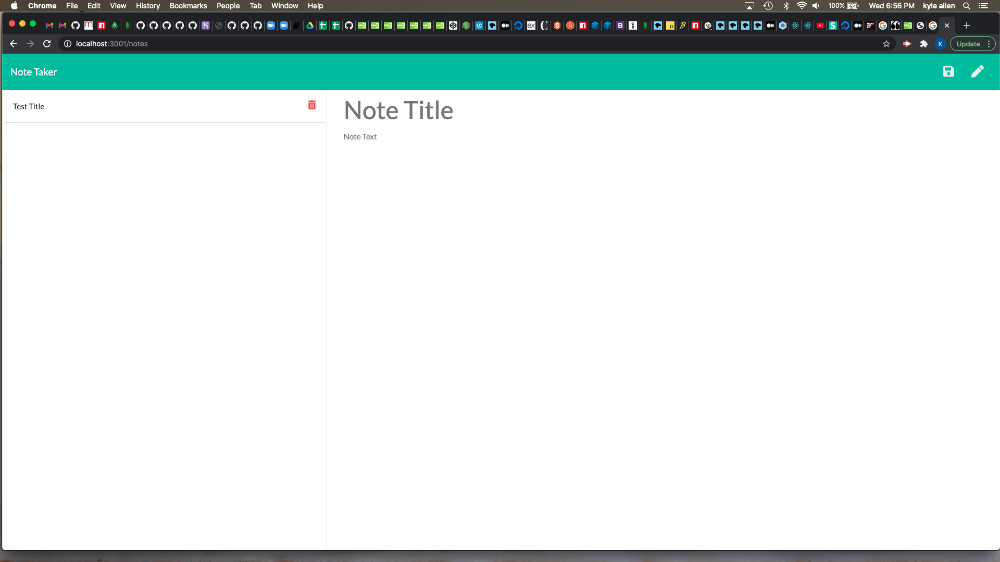

# Title: 11-express-homework

# Description: An application that can be used to write, save, and delete notes.

# Table of Contents 
* [Installation](#installation)
* [Usage](#usage)
* [License](#license)
* [Contributing](#contributing)
* [Tests](#tests)
* [Username](#username)
* [Email](#email)

# Installation: Run the command "node server.js" in the terminal.

# Usage: Writing, saving, and deleting notes.

# License: MIT License

# Contributing: Kyle Allen

# Tests: Run the application and see if you can write, save and delete a new note.

# Username: Kallen478

# Email: Kallen478@gmail.com

Contact me with any questions via email

https://github.com/Kallen478/11-express-homework